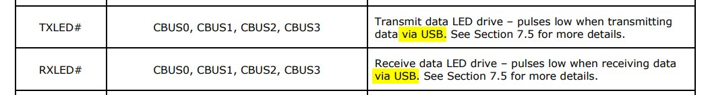
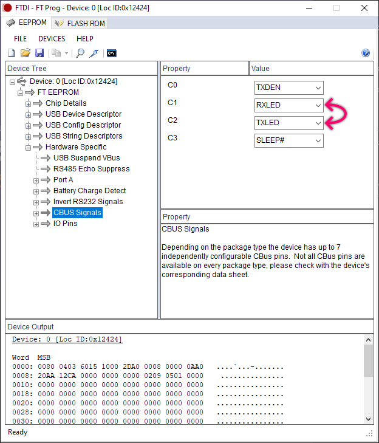

# _Erratum_ Swaped TX and RX leds (FTDI configuration template)

## Root Cause

In default configuration of FT231XS chip Tx and Rx LEDs indicate _activity on USB side_. Hovever for this convertor purpouse, we want to see Tx and Rx activity on _UART side (connector)_. There for Tx and Rx LEDs are swaped (Rx led blinks when data is coming out from Tx PIN).

## Configuration

This problem can be fixed in SW configuration of FT231XS. Here is [`template.xml`](https://raw.githubusercontent.com/ah01/u2s/master/ft_prog/template.xml) for [FT Prog](https://www.ftdichip.com/Support/Utilities.htm#FT_PROG).

Only change is swap configuration for CBUS1 and CBUS2 signals.

